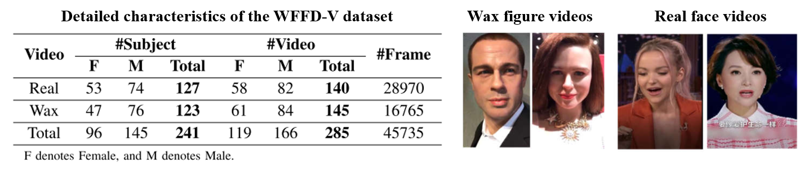

# Wax Figure Face Database (WFFD) for realistic face spoofing [<a href="https://arxiv.org/pdf/1906.11900.pdf?ref=https://githubhelp.com">Paper</a>]


The Wax Figure Face Database (WFFD) verison 1 was proposed in our ICIAP2019 paper (Jia, S. et al., ICIAP2019), which includes wax figure faces as super-realistic 3D presentation attacks. It consists of 2200 images with both real and wax figure faces (totally 4,400 faces) with a high diversity from online collections. 

For more details please refer to our paper:
Jia, Shan, et al. "A database for face presentation attack using wax figure faces." International Conference on Image Analysis and Processing. Springer, Cham, 2019.

## Summary 
The WFFD database contains three folders "ProtocolX" (Protocol ID) with images in three subfolders:

* **Protocol1** :<br/> The wax figure face and real face pairs came from different recording devices and environment, and were grouped manually;
  
* **Protocol2** :<br/> The wax figure face and real face pairs were recorded in the same environment with the same cameras;
    
* **Protocol3** :<br/> Previous two protocols are combined to simulate the real-world operational conditions;

|        | Train   |   Dev   |  Test   |  Total  | 
| :-------: | :-----: | :-----: | :-----: | :-----: |
|   Protocol1   | 600     | 200     | 200     | 1,000   | 
|   Protocol2   | 720     | 240     | 240     | 1,200   | 
|   Protocol3   | 1,320   | 440     | 440     | 2,200   | 

Data labels (i.e., real/wax) are provided in each substet.

The WFFD-V database contains 245 cropped face image sequences in two subfolders:

* **Real** :<br/> Train - 84 sequences, 17,808 faces; Test - 56 sequences, 11,162 faces;
  
* **Wax** :<br/> Train - 87 sequences, 9,095 faces; Test - 58 sequences, 7,670 faces;



## Dataset Download

WFFD dataset
| :-------: | 
|https://drive.google.com/file/d/183FK2fxuKip0rJVV_pJz_R3QDlKHaC8S/view?usp=sharing (google)|
|https://pan.baidu.com/s/10Ku_4fxlKCiTlrdjL0SWSg (Baidu Yun, Password: udnk)|

-----------------------------------------------------------------------------------
WFFD-V dataset
| :-------: | 
|https://drive.google.com/file/d/1q-yikQpecQIYli983not9eeYH57lC58G/view (google)|

Please email me (jias@whu.edu.cn) with **ACADEMIC email address** and **Principal Investigator/Advisor's Name** for the unzip password. Thanks! 

## License and Citation
The WFFD database is released only for academic researches. Any researchers from educational institute are allowed to use this database freely for noncommercial purpose.

If you use this database, please cite the following publication:
```
@inproceedings{jia2019database,
  title={A database for face presentation attack using wax figure faces},
  author={Jia, Shan and Hu, Chuanbo and Guo, Guodong and Xu, Zhengquan},
  booktitle={International Conference on Image Analysis and Processing},
  pages={39--47},
  year={2019},
  organization={Springer}
}

@article{jia20203d,
  title={3D face anti-spoofing with factorized bilinear coding},
  author={Jia, Shan and Li, Xin and Hu, Chuanbo and Guo, Guodong and Xu, Zhengquan},
  journal={IEEE Transactions on Circuits and Systems for Video Technology},
  volume={31},
  number={10},
  pages={4031--4045},
  year={2020},
  publisher={IEEE}
}
